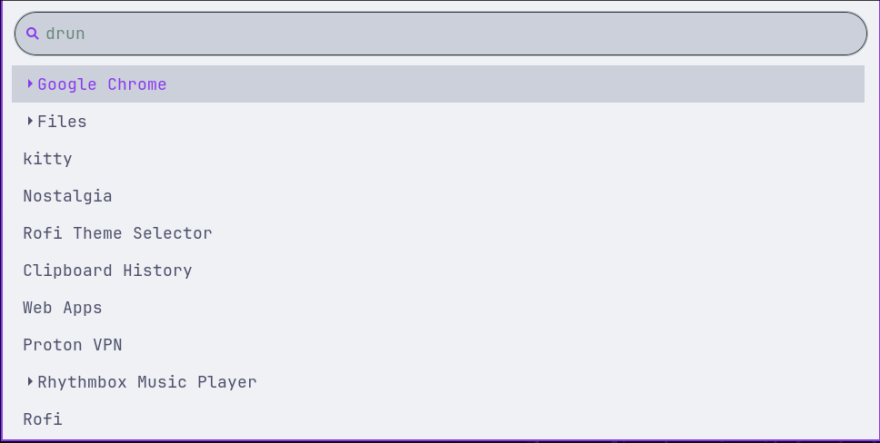
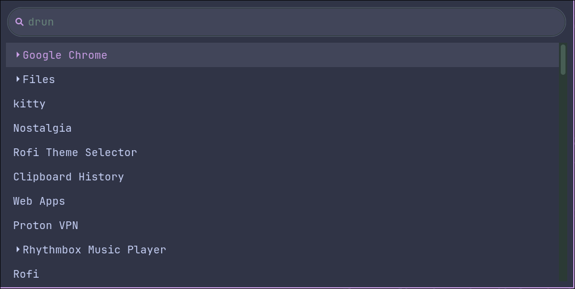

<h3 align="center">
	<br/>
	
	Catppuccin for <a href="https://github.com/SimplyCEO/wofi">Wofi</a>
	
</h3>

<p align="center">
	<a href="https://github.com/catppuccin/wofi/stargazers"></a>
	<a href="https://github.com/catppuccin/wofi/issues"></a>
	<a href="https://github.com/catppuccin/wofi/contributors"></a>
</p>

## Previews

<details>
<summary>🌻 Latte</summary>

</details>

<details>
<summary>🪴 Frappé</summary>

</details>

<details>
<summary>🌺 Macchiato</summary>

</details>

<details>
<summary>🌿 Mocha</summary>

</details>

## Usage

> [!NOTE]
> The files available in this repository only change colors. There are some recommended non-color changes that can be accessed by cloning this repository, installing [whiskers](https://github.com/catppuccin/whiskers), running `whiskers wofi.tera --overrides '{"non_color_overrides": "yes"}'` in the cloned repository, and then using the generated file of your preferred flavour and accent combination for step 2.

1. Download the flavor and accent combination of your choice from [themes/](themes).
2. Copy the CSS file to your Wofi config directory (change `<flavor>` and `<accent>` to the flavor and accent you downloaded):

```bash
mkdir -p ~/.config/wofi
cp <flavor>-<accent>.css ~/.config/wofi/style.css
```

3. Make sure your Wofi config points to the style:

```ini
# ~/.config/wofi/config
style=~/.config/wofi/style.css
```

4. Launch Wofi:

```bash
wofi --show drun
```

## 💝 Thanks to

- [Yaman](https://github.com/CyberHuman-bot)
- [Scarce Koi](https://github.com/scarcekoi)

&nbsp;

<p align="center">
	
</p>
<p align="center">
	Copyright &copy; 2021-present <a href="https://github.com/catppuccin" target="_blank">Catppuccin Org</a>
</p>
<p align="center">
	<a href="https://github.com/catppuccin/catppuccin/blob/main/LICENSE"></a>
</p>
